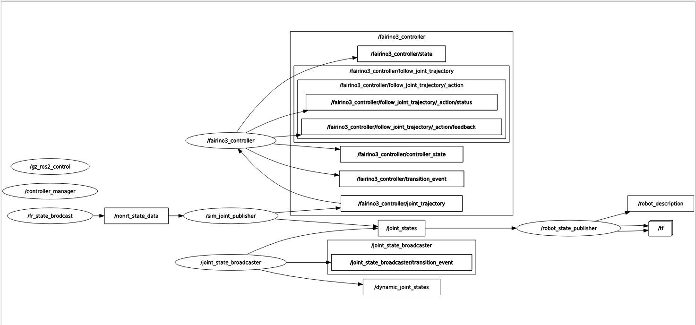

# Porting your Fairino Robot Into Gazebo

## Environment

 This repo is built using ROS2 Humble on Ubuntu 22.04 (Jammy Jellyfish) and Gazebo Fortress 6.17.0 (aka Gazebo Ignition) with the x86_64 architecture.

 If you are using the aarch64 architecture, follow the steps in the Arm64_Setup.md 
 

## Introduction

Hello devs and devinas, in this README I will cover the steps needed to configure your gazebo environment to mirror your Fairino or use the included MoveIt2 module to control your robot. This will also go over the contents of this repository and how they interact as well as how to manipulate them to your specific needs.

## Step 0) Building and installing ROS2
- To install ROS2 Humble, you can follow the instructions on either the ROS2 Humble documentation page (https://docs.ros.org/en/humble/Installation.html) or the Fairino ROS2 manual (https://fairino-doc-en.readthedocs.io/latest/ROSGuide/ros2guide.html)
    - If you choose the latter, then follow instructions until section 2.2 "Compile and build fairino_hardware" since we are going to be using a modified version.
- Install Gazebo Fortress 6.17
- Note that if you are looking to use the ROS2 API commands, you will need to set up a SimMachine to interporate the XML packets sent by the fairino ros2_cmd_server. For SimMachine installation isntructions, follow the guide here (https://fairino-doc-en.readthedocs.io/latest/VMMachine/controller_docker_machine.html)

## Step 1) Building your Fairino workspace

If you build your workspace as is, you will get the following environment:

- A Gazebo Environment with an Fairino robot mirroring your targeted IP <b>`(this repo defaults to 192.168.55.2)`</b>
- The simulated Fairino will follow your physical Fairino or SimMachine
- A MoveIt2 control example that can hook up to your SimMachine or physical hardware
- A digital Fairino controllable via ROS2s /joint_trajectory that is separate from any physical robot or SimMachine

    ### Step 1a) Configuring your IP
    To change the IP address that the state publisher listens to (the target being your Fairino robot) in the following files:
    
    <b> `src/fairino_hardware/include/fairino_hardware/data_types_def.h` </b> 
    
    <b> `src/fairino_gazebo_config/launch/rt_state_data.py` </b> 
    
    <b> `src/fairino_hardware/include/fairino_hardware/fairino_hardware_interface.hpp` </b>
    
    
    Find the line that sets the Controller/Robot IP and change it to match the robot IP you'd like to target.

    ### Step 1b) Choose your control method
    If you prefer to use the Fairino ROS2 API instead of the /joint_trajectories, you'll need to change the IP address in your workspace to match your SimMachine (defaulted to 192.168.58.2) and use <b> ros2 run fairino_hardware ros2_cmd_server</b> which runs
    <b> `src/fairino_hardware/include/src/command_server_node.cpp` </b> 

    An example program of this is in <b>~/ros2_fr_gz/src/fairino_hardware/examples/src/test_msg.py </b>

Now, you can build your workspace by running <b>`colcon build --symlink-install`</b>

## Step 2) Commands to run your Gazebo simulator:

To run the Gazebo Sim to mirror your robot/SimMachine, use the following command (examples for Fr3):

 `$ ros2 launch fairino3_moveit2_config fr3_gazebo_mirror.launch.py`

To run the Gazebo Sim with a simulated Fairino ONLY, use the following command (examples for Fr3):

 `$ ros2 launch fairino3_moveit2_config digital_fr3_gazebo_sim.launch.py`

Note: that this can be done with any of the fairino models

Now, when you open a terminal and use 'rqt_graph' your setup should look like this:
    

Now, you can set up a script using the SDK or ROS2 controllers to control your robot and watch it move in Gazebo!

To command the fully simulated robot, use the ROS2 /joint_trajectory message and send it to the corresponding Fairino ROS2 controller

### POSSIBLE ERRORS:

If your robot shows up as an entity in Gazebo but you cannot see the model, it is usually due to a conflicting resource path. To fix this, close gazebo and write in the following command to your terminal before re-running:

    export IGN_GAZEBO_RESOURCE_PATH=$IGN_GAZEBO_RESOURCE_PATH:~/[path-to-directory]/ros2_fr_gz/install/fairino_description/share

If your terminal says it cannot find the SimJointPublisher.py:
navigate to `/src/fairino{model_number}_moveit2_config/launch` and add an empty folder called "\_\_pycache\_\_"
Now rebuild your workspace.

## Option 2: Steps to run MoveIt2
<h4>To run the MoveIt2 demo system, use:</h4>

 `$ ros2 launch fairino{model_number}_v6_moveit2_config demo.launch.py`

-   <h4>Ex for Fr3:</h4> 
        
    `$ ros2 launch fairino3_v6_moveit2_config demo.launch.py`

## 
